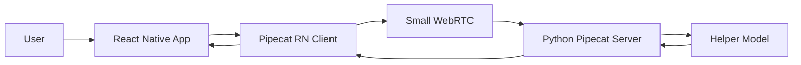

# TalkThrough App Context

This document explains how the React Native app works today, why it is structured this way, and what to look at when changing something.

## What This App Does

The app is a React Native client for the TalkThrough Pipecat server.

Its job is to:
- connect to the Python Pipecat backend over Small WebRTC
- start a live roleplay session
- receive custom server messages for:
  - translation
  - suggestions
  - completion/judge output
- display the conversation state in the UI

The backend does the heavy lifting:
- live Gemini voice conversation
- helper model call for translation, suggestions, and completion judgment

The app is mainly responsible for:
- connection setup
- microphone/media initialization
- listening to Pipecat callbacks
- showing session data cleanly

## High-Level Flow



In plain English:

1. The user taps connect in the app.
2. The app creates a Pipecat client.
3. The Pipecat client connects to the backend through Small WebRTC.
4. The backend runs the live voice roleplay.
5. After each assistant turn, the backend sends extra structured data back:
   - translation
   - suggestions
   - judge/completion state
6. The app updates the UI.

## Current File Structure

```text
app/
├── app.json
├── Makefile
├── README.md
├── CONTEXT.md
├── scripts/
│   └── patch-rn-deps.mjs
├── src/
│   ├── app/
│   │   ├── _layout.tsx
│   │   └── index.tsx
│   ├── features/
│   │   └── roleplay/
│   │       ├── options.ts
│   │       └── RoleplayDebugScreen.tsx
│   └── lib/
│       └── pipecat/
│           ├── client.ts
│           ├── types.ts
│           └── useRoleplaySession.ts
└── ios/ android/
```

## What Each Important File Does

### [app.json](/Users/adityabhattad/Desktop/Github/talkthrough/app/app.json)

Expo app configuration.

This is where we define:
- app name and bundle ids
- native plugin config
- Daily Expo plugin settings
- minimum native platform settings

Change this when you need:
- permissions
- bundle/package ids
- native plugin behavior
- splash/icon config

### [src/app/_layout.tsx](/Users/adityabhattad/Desktop/Github/talkthrough/app/src/app/_layout.tsx)

Top-level Expo Router layout.

Right now it is intentionally minimal:
- imports `react-native-get-random-values`
- wraps the app with `SafeAreaProvider`
- renders the current route

If the whole app needs a provider later, this is a likely place for it.

### [src/app/index.tsx](/Users/adityabhattad/Desktop/Github/talkthrough/app/src/app/index.tsx)

Entry screen route.

Right now it just renders the debug roleplay screen.

Later this can become:
- a home screen
- a scenario list
- or a router redirect

### [src/features/roleplay/RoleplayDebugScreen.tsx](/Users/adityabhattad/Desktop/Github/talkthrough/app/src/features/roleplay/RoleplayDebugScreen.tsx)

Current UI screen for testing the full voice flow.

It shows:
- server URL
- scenario selector
- language selector
- transport state
- latest bot line
- translation
- suggestions
- judge output
- transcript

This file should stay mostly UI-focused.

If business logic starts growing here, move it into:
- the hook
- helper functions
- a dedicated state layer

### [src/features/roleplay/options.ts](/Users/adityabhattad/Desktop/Github/talkthrough/app/src/features/roleplay/options.ts)

Simple UI options for scenarios and languages.

Good place for:
- labels
- picker/chip options

Not a good place for:
- connection logic
- network calls

### [src/lib/pipecat/client.ts](/Users/adityabhattad/Desktop/Github/talkthrough/app/src/lib/pipecat/client.ts)

Creates the Pipecat client.

This file is the bridge between our app and Pipecat RN packages.

It currently:
- creates `DailyMediaManager`
- creates `RNSmallWebRTCTransport`
- creates `PipecatClient`

If we ever change transport or media manager, start here.

### [src/lib/pipecat/types.ts](/Users/adityabhattad/Desktop/Github/talkthrough/app/src/lib/pipecat/types.ts)

Type definitions for:
- app-side session state
- helper message payloads
- transcript items

If server message shapes change, this is one of the first places to update.

### [src/lib/pipecat/useRoleplaySession.ts](/Users/adityabhattad/Desktop/Github/talkthrough/app/src/lib/pipecat/useRoleplaySession.ts)

This is the main app-side session controller.

It:
- creates the Pipecat client
- subscribes to Pipecat callbacks
- stores transport state
- stores transcript state
- stores helper output
- exposes `connect()` and `disconnect()`

This is the best file to read if you want to understand the app’s realtime behavior.

If something in the live session flow is wrong, this is usually the first file to inspect.

## How Connection Startup Works

The app currently connects like this:

1. UI calls `connect(...)`.
2. `useRoleplaySession` calls `client.initDevices()`.
3. Then it calls `client.startBotAndConnect(...)`.
4. The request goes to:
   - `http://localhost:7860/start`
5. We send:
   - `scenario_id`
   - `language`
6. Backend starts the session and the realtime call begins.

Important detail:

We send request data like this:

```ts
requestData: {
  body: {
    scenario_id: scenarioId,
    language: languageId,
  },
}
```

That shape matters because the Pipecat server expects the actual request payload inside `body`.

## Why We Use `adb reverse`

On a real Android device, `localhost` means the phone itself, not your laptop.

So this command:

```bash
adb reverse tcp:7860 tcp:7860
```

means:
- when the phone requests `http://localhost:7860`
- forward that to your laptop’s `localhost:7860`

That lets the mobile app reach the local Pipecat server without hardcoding your LAN IP.

## Why There Is A Patch Script

### The short version

We currently depend on a few upstream React Native packages that have small compatibility issues in this exact setup.

Instead of editing `node_modules` manually after every install, we keep one script that reapplies those fixes automatically.

That script is:
- [scripts/patch-rn-deps.mjs](/Users/adityabhattad/Desktop/Github/talkthrough/app/scripts/patch-rn-deps.mjs)

It runs automatically via:
- `postinstall` in [package.json](/Users/adityabhattad/Desktop/Github/talkthrough/app/package.json)

### The actual bug it fixes

The important bug is in Pipecat’s RN Small WebRTC transport.

Upstream code assumes the peer connection already exists:

```js
return this.pc.getTransceivers()[AUDIO_TRANSCEIVER_INDEX];
```

But during connection setup, there is a timing window where `this.pc` can still be `null`.

That caused this runtime error:

```text
TypeError: Cannot read property 'getTransceivers' of null
```

Our fix changes the logic to:
- check whether `this.pc` exists
- if not, return `null`
- let the rest of the code continue safely

Conceptually, the change is:

```js
const transceivers = this.pc?.getTransceivers?.();
return transceivers?.[index] ?? null;
```

That is the real functional fix.

### The warning cleanup

The script also patches `@daily-co/react-native-webrtc` to reduce noisy development warnings:

1. `NativeEventEmitter` warning
   - React Native expects the native module to expose `addListener` and `removeListeners`
   - the current module shape does not
   - we provide a harmless fallback object so the warning stops appearing

2. `MediaDevices` log spam
   - upstream logs device monitor events very noisily
   - we remove those log lines because they do not help normal development

These two are mostly cleanup.
The transceiver null-check is the real bug fix.

## When To Remove The Patch Script

If upstream packages fix these issues, remove the script.

The likely removal condition is:
- Pipecat RN transport adds null-safe transceiver access
- Daily RN WebRTC resolves the emitter/logging issues

At that point:
1. remove `patch-rn-deps.mjs`
2. remove `patch-rn-deps` and `postinstall` from `package.json`
3. reinstall dependencies
4. verify logs stay clean

## Where To Look If You Need To Change Something

### Change session UI

Start in:
- [src/features/roleplay/RoleplayDebugScreen.tsx](/Users/adityabhattad/Desktop/Github/talkthrough/app/src/features/roleplay/RoleplayDebugScreen.tsx)

### Change session behavior / callback handling

Start in:
- [src/lib/pipecat/useRoleplaySession.ts](/Users/adityabhattad/Desktop/Github/talkthrough/app/src/lib/pipecat/useRoleplaySession.ts)

### Change transport or media manager

Start in:
- [src/lib/pipecat/client.ts](/Users/adityabhattad/Desktop/Github/talkthrough/app/src/lib/pipecat/client.ts)

### Change native plugin settings

Start in:
- [app.json](/Users/adityabhattad/Desktop/Github/talkthrough/app/app.json)

### Change Android local dev forwarding

Start in:
- [Makefile](/Users/adityabhattad/Desktop/Github/talkthrough/app/Makefile)
- root [Makefile](/Users/adityabhattad/Desktop/Github/talkthrough/Makefile)

### Change or remove the dependency compatibility patch

Start in:
- [scripts/patch-rn-deps.mjs](/Users/adityabhattad/Desktop/Github/talkthrough/app/scripts/patch-rn-deps.mjs)
- [package.json](/Users/adityabhattad/Desktop/Github/talkthrough/app/package.json)

## Current Practical State

Today, the app is:
- on Expo SDK 54
- using a dev build
- using Pipecat RN Small WebRTC transport
- using a small postinstall compatibility patch

That is a reasonable development setup.

The main thing to remember is:
- most app logic is ours
- the patch script exists only because of a small upstream transport/runtime gap

It should stay small, explicit, and well-documented.
