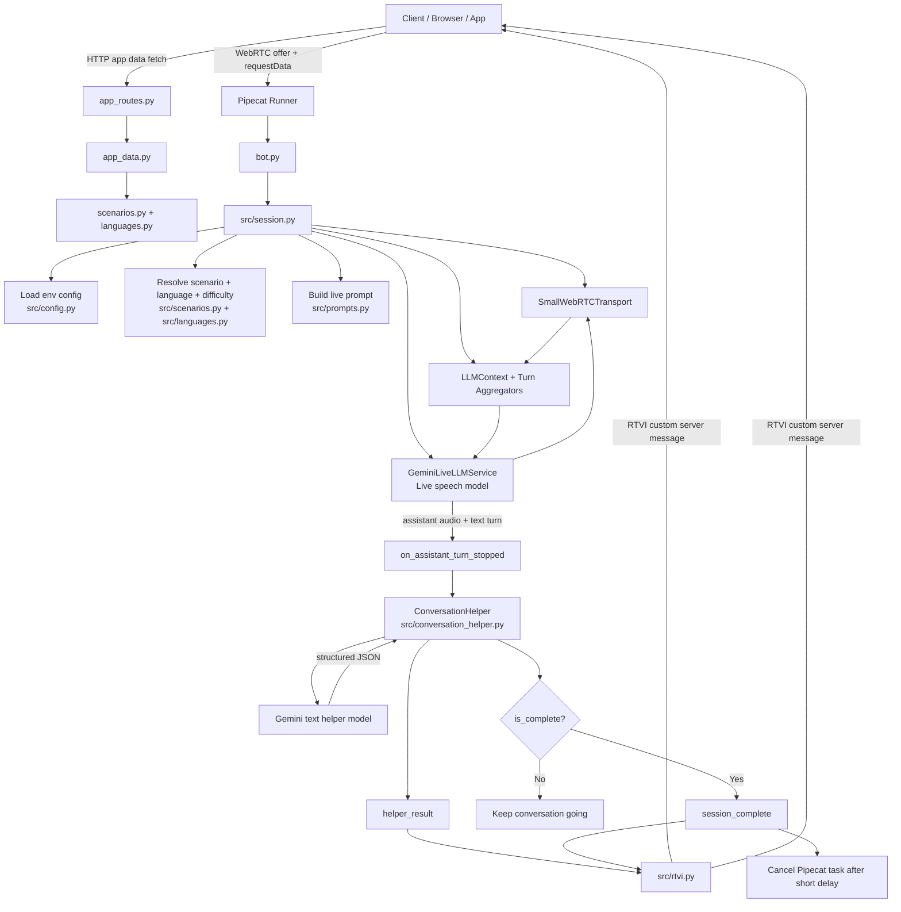

# Server Architecture

This document explains how the current `server/` works.

The server has one job:

1. serve app-facing scenario data for the mobile client
2. run the live voice roleplay with Pipecat + Gemini Live
3. after each assistant turn, call one helper model
4. send the helper result back to the client
5. end the session automatically when the helper decides the conversation is over

The important distinction now is:

- `/app/*` routes are the app contract
- `/debug-client` and `/scenario-details` are developer helpers

The long-term plan is for the app contract to stay stable even when scenario data moves from JSON files to a database later.

## App Data Layer

The server now has a small app-facing content layer in:

- [src/app_data.py](src/app_data.py)
- [src/app_routes.py](src/app_routes.py)

Current app routes:

- `GET /app/home`
- `GET /app/scenarios`
- `GET /app/scenarios/{scenario_id}`

These routes are backed by the scenario JSON files today, but they are intentionally separated from debug routes so we can swap the storage backend later without changing the app payload shape.

## Scenario Model

Scenario content is no longer a single freeform `behavior_prompt`.

Each scenario now carries:

- scenario card metadata for the home screen
- character identity and role
- learner goal
- pragmatic tip
- structured vocabulary items
- language-specific opening lines
- character agenda
- character personality
- success conditions
- failure conditions
- difficulty overlays for `easy`, `medium`, and `hard`

Difficulty is implemented as a prompt overlay, not a separate scenario. The same scenario becomes easier or harder by changing the character's patience, friction, and decision rules.

For negotiation scenarios, the live prompt is now meant to be agenda-driven instead of scripted. The character should maximize their own outcome realistically, not enforce one magic answer like "accept only 150."

## High-Level Flow



## Core Design Idea

We intentionally split the system into two model roles:

- `Gemini Live`
  - handles the actual live conversation
  - speaks as the character
  - should stay focused on roleplay only

- `Helper model`
  - reads the assistant's latest line plus conversation context
  - returns:
    - English translation
    - learner reply suggestions
    - completion decision

This split is important. We tried putting session-ending responsibility directly inside the live model via tool calling, but that created unstable conversational behavior. The current architecture is more reliable because the live model only has to converse, while the helper model judges and annotates each turn separately.

## Session Lifecycle

### 1. Client connects

The Pipecat runner receives a WebRTC offer. The client also sends `requestData`, for example:

```json
{
  "scenario_id": "auto-rickshaw",
  "language": "marathi",
  "difficulty_id": "medium"
}
```

`src/session.py` reads that data and decides which scenario, language, and difficulty to use.

### 2. Live pipeline starts

`src/session.py` creates:

- `SmallWebRTCTransport`
- `LLMContext`
- user turn aggregator
- assistant turn aggregator
- `GeminiLiveLLMService`

These are assembled into the Pipecat pipeline:

```text
transport.input()
-> user_aggregator
-> GeminiLiveLLMService
-> transport.output()
-> assistant_aggregator
```

### 3. Roleplay starts

When the client is ready, the server seeds the context with:

- "Start the roleplay now. Speak first..."

Then it queues an `LLMRunFrame()` so the character speaks first.

### 4. User and assistant turns are captured

The aggregators emit final text when a turn ends:

- `on_user_turn_stopped`
- `on_assistant_turn_stopped`

We store those lines in memory in `SessionState.conversation_lines`.

### 5. Helper model runs after every assistant turn

When the assistant finishes a turn:

1. the latest assistant line is added to `conversation_lines`
2. `ConversationHelper.analyze_turn(...)` is called
3. the helper returns structured JSON

That JSON includes both UI help and session control:

```json
{
  "translation": "...",
  "suggestions": [
    {"romanized": "...", "english": "..."}
  ],
  "is_complete": false,
  "outcome": "in_progress",
  "reason": "..."
}
```

### 6. Client gets helper output

The server sends a custom RTVI message called `helper_result`.

The debug UI uses that to render:

- translation
- suggestions
- judge state

### 7. Session ends automatically if complete

If `is_complete` is `true`, the server sends a second message:

- `session_complete`

That includes:

- `outcome`
- `reason`
- full transcript

Then the server waits about 1 second and cancels the Pipecat task.

## Why There Are Two Server Messages

You may see two custom server messages near the end of a session:

1. `helper_result`
2. `session_complete`

This is expected.

Reason:

- `helper_result` is sent after every assistant turn, whether complete or not
- `session_complete` is only sent when the helper says the conversation is over

So the final assistant turn often causes both messages back-to-back.

## Important Files

### `bot.py`

Thin Pipecat entrypoint.

Responsibilities:

- load `.env`
- register debug route import
- expose the top-level `bot(runner_args)` function Pipecat expects
- call `main()`

Change this file only if:

- startup flow changes
- Pipecat runner integration changes
- you want to add more top-level routes/imports

### `src/session.py`

This is the most important file in the server.

Responsibilities:

- read incoming request data
- create transport
- create Pipecat pipeline
- initialize live model
- listen for user/assistant turn completion
- call the helper model
- send helper/session-complete messages
- end the session when complete

If you want to understand "what actually happens during a call", start here.

### `src/config.py`

Loads environment variables into a typed `Settings` object.

Current important settings:

- `GOOGLE_API_KEY`
- `GOOGLE_MODEL`
- `GOOGLE_HELPER_MODEL`
- `GOOGLE_VOICE_ID`
- `GOOGLE_HELPER_THINKING_LEVEL`

Change this file when:

- adding new env vars
- changing defaults
- validating config

### `src/scenarios.py`

Contains scenario definitions.

Right now it loads JSON scenario files from `server/scenarios/`:

- one richer `Scenario` dataclass
- vocabulary and difficulty dataclasses
- one folder of structured scenario JSON files
- cached loader functions like `load_scenarios()` and `get_scenario(...)`

Change this file when:

- adding a new scenario
- changing default language
- changing opening lines
- changing agenda, personality, or difficulty rules
- changing learner goal or vocabulary

### `src/app_data.py` and `src/app_routes.py`

This is the current app-facing content boundary.

Responsibilities:

- shape home payloads
- shape scenario detail payloads
- keep frontend data contracts separate from debug tooling
- provide the seam where JSON-backed content can later become DB-backed content

Change these files when:

- the app needs new content fields
- home or scenario payload shapes change
- you want to preserve app contract stability during backend refactors

### `src/languages.py`

Loads language metadata from `server/languages/`.

Change this file when:

- adding a new language
- changing default language resolution
- changing how language ids or names are normalized

### `src/prompts.py`

Builds all prompts and helper inputs.

Main functions:

- `build_character_system_prompt(...)`
- `build_helper_input(...)`
- `build_helper_system_prompt(...)`

Change this file when:

- live character behavior is wrong
- helper suggestions are bad
- translation style needs adjustment
- completion judgment is too eager or too conservative

### `src/conversation_helper.py`

Wraps the non-live Gemini model call.

Responsibilities:

- call helper model with structured JSON schema
- parse the result
- return a typed `ConversationHelperResult`

This file is performance-sensitive because it runs after every assistant turn.

Change it when:

- adjusting helper model settings
- changing helper schema
- adding/removing returned fields
- adding retries or telemetry

### `src/rtvi.py`

Small helper module for sending custom messages to the client.

Current custom message types:

- `helper_result`
- `session_complete`

Change this file when:

- client payload shape changes
- more custom UI messages are needed

### `src/debug_routes.py`

Adds `/debug-client` to the same FastAPI app Pipecat runner uses.

Change this file when:

- adding more custom debug pages
- changing debug route paths

### `src/debug_client.py`

Contains the HTML/JS debug UI as one Python string.

It is intentionally ugly-but-useful.

Responsibilities:

- connect to `/start`
- show transcript
- show helper translation/suggestions
- show helper completion decision
- show raw custom server message
- show debug logs

Change this file when:

- debug UI layout changes
- client-side event handling changes
- you want better developer tooling

## File Structure

```text
server/
├── ARCHITECTURE.md
├── CONTEXT.md
├── README.md
├── bot.py
├── pyproject.toml
├── languages/
│   ├── kannada.json
│   └── marathi.json
├── scenarios/
│   ├── auto-rickshaw.json
│   ├── chai-stall.json
│   ├── sabzi-mandi.json
│   ├── pharmacy.json
│   ├── landlord-call.json
│   └── doctor-visit.json
├── uv.lock
└── src/
    ├── __init__.py
    ├── config.py
    ├── languages.py
    ├── scenarios.py
    ├── prompts.py
    ├── conversation_helper.py
    ├── rtvi.py
    ├── session.py
    ├── debug_routes.py
    └── debug_client.py
```

## Where To Change Things

### Change the character behavior

Go to:

- `src/scenarios.py` for scenario content
- `src/prompts.py` for how that content becomes a system prompt

### Change the live model or voice

Go to:

- `src/config.py`
- `.env`

### Change translation quality or suggestions

Go to:

- `src/prompts.py`
- `src/conversation_helper.py`

### Change when the conversation ends

Go to:

- `src/prompts.py`
  - helper judgment instructions
- `src/conversation_helper.py`
  - helper schema if needed
- `src/session.py`
  - what happens after `is_complete`

### Change client payloads

Go to:

- `src/rtvi.py`
- `src/debug_client.py`

### Add a new scenario

Start with:

- `server/scenarios/<your-scenario>.json`

Then verify:

- prompt still makes sense in `src/prompts.py`
- client is sending the right `scenario_id`

### Add a new language

Start with:

- `server/languages/<your-language>.json`

Then verify:

- scenarios point at the right `default_language_id`
- prompts still read naturally in `src/prompts.py`
- the client sends the right language id

## Current Tradeoffs

These are intentional for now:

- scenario content is in local JSON files, not a database yet
  - simpler for early development and easy to migrate later
- debug UI is embedded as one HTML string
  - fast to iterate, not ideal long term
- full conversation history is sent to helper
  - simpler, but may be slower as conversations get longer

## Likely Future Improvements

- move scenarios into structured content files
- trim helper context to only recent turns
- add transcript persistence
- add post-conversation review scoring
- create a real app UI instead of relying on the debug client
- break `debug_client.py` into proper frontend files if it grows more
