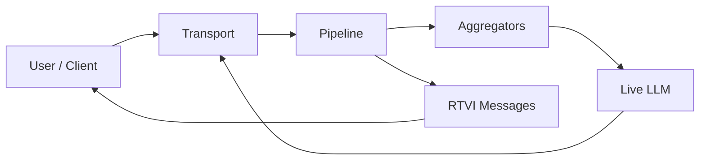
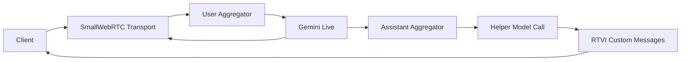
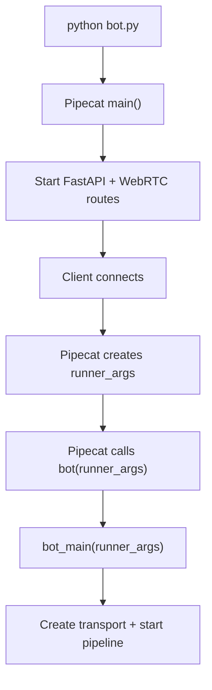

# Server Context

This file explains:

- what this server is doing
- why it is built this way
- what not to accidentally break
- where to start if you need to modify something

## What This Project Is

This server powers the roleplay part of a language-learning app.

The app idea is:

- user speaks to an AI character in a real-world scenario
- the AI character responds in the target language
- the user also gets help:
  - translation
  - suggested replies
  - automatic detection of when the scenario is complete

Right now the server is set up around six Bangalore-life scenarios backed by structured JSON content.

The target language is configurable per session. Kannada is still the product direction, but Marathi remains intentionally supported for debugging and prompt iteration.

## Main Mental Model

Think of the server as three layers:

### Layer 0: App data

This is the plain HTTP content contract used by the mobile app.

It serves:

- home screen payloads
- scenario detail payloads
- difficulty and language-aware content

Today it is JSON-backed. Later it can become DB-backed without changing the app contract.

### Layer 1: Live conversation

This is the actual roleplay.

It uses:

- Pipecat
- SmallWebRTC
- Gemini Live

This layer should feel like a normal back-and-forth spoken conversation.

### Layer 2: Helper intelligence

This is not the roleplay itself.

This layer watches each completed assistant turn and answers:

- what did the character just say in English?
- what could the learner say next?
- is the scenario now over?

This uses a normal Gemini text model, not the live voice model.

That split is important.

## Simple Pipecat Diagram

If you are new to Pipecat, this is the simplest useful mental model:



What these mean:

- `Transport`
  - moves audio and connection data between client and server
- `Pipeline`
  - the ordered chain that wires the live call together
- `Aggregators`
  - convert streaming speech/text into completed turns
- `Live LLM`
  - the character that is actually speaking in realtime
- `RTVI Messages`
  - structured non-audio messages sent to the client, like subtitles and completion state

A more codebase-specific version looks like this:



In this project:

- `SmallWebRTC Transport` handles the live audio path
- `User Aggregator` tells us when the learner has finished speaking
- `Assistant Aggregator` tells us when Ravi has finished speaking
- `Helper Model Call` generates translation, suggestions, and completion judgment
- `RTVI Custom Messages` send helper results back to the UI

Alongside the live pipeline, the app also fetches metadata over HTTP:

- `GET /app/home`
- `GET /app/scenarios`
- `GET /app/scenarios/{id}`

## Why The Architecture Looks Like This

We learned a few things during development:

### 1. The live model should stay focused on speaking

We tried letting the live model also decide when the session should end via tool calling.

That turned out to be unstable in practice. The model sometimes got stuck or behaved awkwardly inside the live audio loop.

So we changed the design:

- live model only talks
- helper model judges and annotates

This is the most important architecture decision in the current server.

### 2. Translation and judgment should be one helper call

Originally they were two separate calls:

- one translator call
- one judge call

That was slower and made the UI wiring messier.

Now they are combined into one helper model call that returns:

- translation
- suggestions
- completion decision
- completion reason

This reduced complexity and should improve latency.

### 3. The debug UI is for understanding the system, not for production

The `/debug-client` page exists so we can see:

- transcript
- helper output
- judge decision
- raw RTVI messages

It is a developer tool, not final product UI.

### 4. Difficulty now lives in the prompt model

Difficulty is no longer meant to be a separate scenario script.

Each scenario now includes:

- character agenda
- character personality
- success and failure conditions
- `easy`, `medium`, and `hard` behavior overlays

The important rule is that characters should act on their own incentives realistically. They should not enforce one hidden correct answer. A driver can still accept an unusually favorable fare, and a tougher difficulty should come from higher friction and sharper personality, not from broken logic.

## Current File Map

### Entry and startup

- `bot.py`
  - Pipecat entrypoint

### Runtime orchestration

- `src/session.py`
  - main call/session logic

### Configuration

- `src/config.py`
  - env vars and defaults

### Language content

- `src/languages.py`
  - language loader and `Language` dataclass
- `server/languages/*.json`
  - actual language metadata files

### Scenario content

- `src/scenarios.py`
  - scenario loader and `Scenario` dataclass
- `server/scenarios/*.json`
  - actual scenario content files

### App-facing content

- `src/app_data.py`
  - shapes home and scenario payloads for the mobile app
- `src/app_routes.py`
  - exposes `/app/*` routes

### Prompt construction

- `src/prompts.py`
  - live prompt
  - helper prompt
  - helper input payload

### Helper model

- `src/conversation_helper.py`
  - structured JSON helper call

### Client message sending

- `src/rtvi.py`
  - sends `helper_result`
  - sends `session_complete`

### Debug tooling

- `src/debug_routes.py`
  - `/debug-client` route
  - compatibility helper routes for debugging only
- `src/debug_client.py`
  - HTML + JS debug page

## What Happens In One Session

1. Client connects through Pipecat SmallWebRTC.
2. Client sends `requestData`, including scenario, language id, and difficulty id.
3. Server creates the live Pipecat pipeline.
4. Live model starts roleplay and speaks first.
5. User speaks.
6. Assistant speaks.
7. When assistant finishes a turn:
   - server stores the final assistant text
   - server calls the helper model
   - helper returns translation, suggestions, completion state
   - server sends `helper_result` to client
8. If helper says the session is complete:
   - server sends `session_complete`
   - server cancels the session shortly after

## How `main()`, `bot()`, and `runner_args` Work

This is one of the easiest parts of the codebase to get confused by.

In `bot.py`, we do two separate things:

1. define a top-level `bot(runner_args)` function
2. call Pipecat's `main()`

That can look strange at first because `main()` does not directly call `bot()` in our file.

What actually happens is:



### What `main()` does

Pipecat's `main()` starts the development runner server.

That runner:

- creates the FastAPI app
- registers routes like `/start` and `/api/offer`
- waits for a client to begin a session

So `main()` means:

- "start the server infrastructure"

not:

- "run my roleplay bot right now"

### What `bot(runner_args)` is

Pipecat expects your module to expose a top-level function named `bot`.

When a client starts a session, Pipecat looks up that function and calls it automatically.

That means we never call `bot(...)` ourselves.

Pipecat calls it for each session.

### What `runner_args` is

`runner_args` is an object created by Pipecat for one specific client session.

In our current setup it contains session-related data such as:

- the WebRTC connection object
- request body data from the client

In our code we use it mainly for:

- creating the `SmallWebRTCTransport`
- reading `requestData` like `scenario_id` and `language`

So the mental model is:

- `main()` starts the Pipecat server
- Pipecat waits for a client
- Pipecat creates `runner_args` when a session begins
- Pipecat calls `bot(runner_args)`
- our `bot(...)` forwards into `bot_main(...)`

## Important Message Types

The client currently receives two custom server messages:

### `helper_result`

Sent after every assistant turn.

Contains:

- translation
- suggestions
- `isComplete`
- `outcome`
- `reason`

### `session_complete`

Sent only when the helper decides the conversation is over.

Contains:

- `outcome`
- `reason`
- transcript

## If You Need To Change Something

### "The character is speaking wrong"

Start here:

- `server/scenarios/*.json`
- `src/scenarios.py`
- `src/prompts.py`

### "The helper suggestions are bad"

Start here:

- `src/prompts.py`
- `src/conversation_helper.py`

### "The helper ends the conversation too early or too late"

Start here:

- `src/prompts.py`
  - especially `build_helper_system_prompt`

Then if needed:

- adjust helper model or thinking level in `src/config.py`

### "The client UI is wrong"

Start here:

- `src/debug_client.py`

### "The wrong scenario or language is loading"

Start here:

- `src/session.py`
  - `_extract_request_data`
  - `bot_main`
- `src/languages.py`
- `src/scenarios.py`

### "The live audio pipeline is broken"

Start here:

- `src/session.py`
  - transport creation
  - pipeline setup
- `bot.py`

## Beginner Notes

If you are new to Python:

- `@dataclass`
  - a simple way to define a structured object with fields
- `async def`
  - asynchronous function
- `await`
  - pause until an async operation completes

If you are new to Pipecat:

- `Transport`
  - how audio/video/data gets in and out
- `Pipeline`
  - ordered flow of components
- `Aggregator`
  - combines partial streaming content into final turns
- `PipelineTask`
  - running pipeline instance
- `RTVI`
  - client/server realtime messaging layer used for custom messages

If you are new to this codebase:

- read `src/session.py` first
- then `src/conversation_helper.py`
- then `src/prompts.py`

That order gives the clearest picture.

## Current Defaults

From config:

- live model: `models/gemini-3.1-flash-live-preview`
- helper model: `models/gemini-3-flash-preview`
- helper thinking: `LOW`

The helper thinking level is intentionally low for speed.

## Things To Be Careful About

### Do not overload the live model

If you are tempted to make the live model:

- judge completion
- do transcript review
- make complex tool decisions

be careful.

That logic is better in the helper path unless there is a strong reason otherwise.

### Do not casually change client payload shapes

If you change:

- `helper_result`
- `session_complete`

you must update:

- `src/rtvi.py`
- `src/debug_client.py`

### Be mindful of latency

Helper calls happen after every assistant turn.

So these affect responsiveness a lot:

- helper model choice
- helper thinking level
- prompt size
- transcript length sent to helper

## Recommended Next Reading

1. `ARCHITECTURE.md`
2. `src/session.py`
3. `src/conversation_helper.py`
4. `src/prompts.py`
5. `src/debug_client.py`

## Scenario Storage

Scenarios are now kept in:

```text
server/scenarios/
```

Each scenario is one JSON file.

Why this is better than hardcoding scenarios in Python:

- easier to add or edit content without touching runtime logic
- cleaner separation between "content" and "code"
- easier to migrate later into a database or CMS
- easier for future agents to reason about

So:

- `src/scenarios.py` = loading logic
- `server/scenarios/*.json` = actual scenario content

## Language Storage

Languages are now kept in:

```text
server/languages/
```

Each language is one JSON file.

Why this is useful:

- separates language metadata from runtime code
- makes future database migration easier
- gives us one place for language-specific notes like script and romanization guidance

So:

- `src/languages.py` = loading logic
- `server/languages/*.json` = actual language metadata
